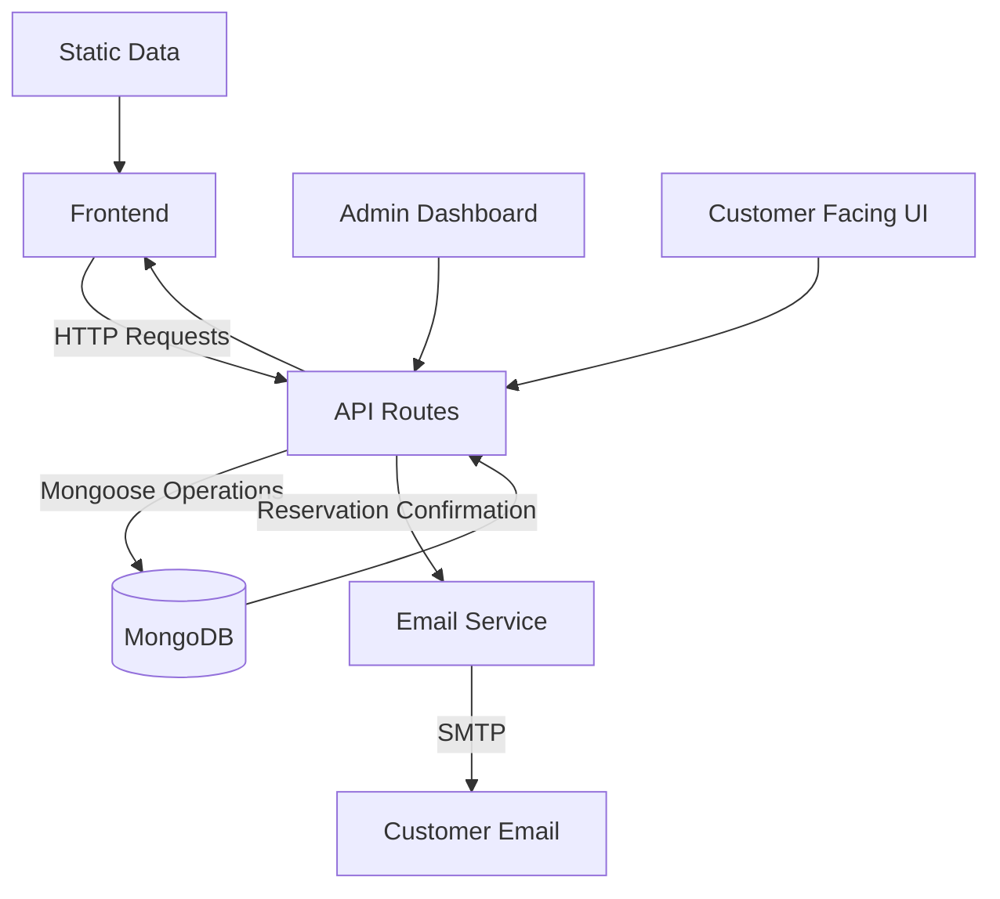

# Aroma Indian & Arabic Restaurant Website

A full-featured, multilingual restaurant website built with Next.js, supporting menu management, reservations, testimonials, gallery, and more. Designed for both customers and administrators, it offers a seamless, elegant experience for browsing, booking, and managing restaurant content.

---

## Table of Contents
- [Project Overview](#project-overview)
- [Features](#features)
- [Tech Stack & Packages](#tech-stack--packages)
- [Repository Structure](#repository-structure)
- [Data Models & Flow](#data-models--flow)
- [API Endpoints](#api-endpoints)
- [Forms & User Interactions](#forms--user-interactions)
- [Localization & Internationalization](#localization--internationalization)
- [Static & Media Assets](#static--media-assets)
- [Getting Started](#getting-started)
- [Contributing](#contributing)
- [License](#license)

---

## Project Overview
This project is a modern, production-ready restaurant website for "Aroma Indian & Arabic Restaurant." It features:
- Multilingual support (English, Arabic, Russian)
- Dynamic menu management (admin CRUD)
- Online reservation system with email confirmations
- Customer testimonials
- Restaurant story and gallery
- Admin dashboard for content management
- Responsive, accessible UI
- Legal pages (Privacy, Terms, Accessibility)

---

## Features
- **Menu Management:** Add, edit, and organize menu sections and items in multiple languages.
- **Reservations:** Customers can book tables; admins manage reservations with email confirmations.
- **Testimonials:** Collect and display customer feedback.
- **Gallery:** Showcase food, drinks, interiors, and more with dynamic filtering.
- **Restaurant Story:** Share the brand's story in multiple languages.
- **Menu Copy Management:** Admin-controlled intro paragraphs for menu pages.
- **Authentication:** Secure admin login with NextAuth.js.
- **Localization:** All content is translatable and locale-aware.
- **Admin Dashboard:** Manage all content from a protected interface.
- **Email Notifications:** Automatic reservation confirmations via SMTP.

---

## Tech Stack & Packages

### Core Frameworks & Libraries
- **Next.js**: App router, SSR, API routes, static generation
- **React**: UI components
- **TypeScript**: Type safety
- **Tailwind CSS**: Utility-first styling
- **Mongoose**: MongoDB ODM
- **NextAuth.js**: Authentication
- **next-intl**: Internationalization

### UI & UX
- **@radix-ui/react-***: Accessible UI primitives (accordion, dialog, menu, etc.)
- **framer-motion**: Animations
- **lucide-react**: Icon library
- **embla-carousel-react**: Carousels
- **sonner**: Toast notifications
- **react-hook-form**: Form state management
- **zod**: Schema validation
- **@hookform/resolvers**: Zod integration

### Utilities
- **clsx, class-variance-authority**: Conditional class names
- **date-fns**: Date utilities
- **zustand**: State management
- **node-fetch**: Server-side HTTP requests
- **bcryptjs**: Password hashing
- **nodemailer**: Email functionality

### Dev & Build Tools
- **eslint, typescript**: Linting and type checking
- **tailwindcss, postcss**: Styling

---

## Repository Structure

```plaintext
restaurant-website/
├── app/
│   ├── [locale]/
│   │   ├── (With Nav & Footer)/
│   │   │   ├── (homepage)/
│   │   │   │   ├── _components/         # Homepage sections (Hero, Menu, Story, etc.)
│   │   │   │   └── page.tsx             # Homepage entry
│   │   │   ├── (otherRoutes)/           # About, Menu, Gallery, Reservation, etc.
│   │   │   │   ├── [feature]/           # Each feature/page (about, menu, login, etc.)
│   │   │   │   │   └── page.tsx         # Page entry
│   │   │   │   └── ...
│   │   │   └── layout.tsx               # Layout with navigation/footer
│   │   ├── globals.css                  # Global styles
│   │   └── layout.tsx                   # Locale root layout
│   ├── api/                             # API routes (Next.js)
│   │   ├── [feature]/                   # menu-sections, reservations, testimonials, etc.
│   │   │   ├── route.ts                 # RESTful endpoint
│   │   │   └── [id]/route.ts            # ID-based endpoint
│   │   └── ...
│   └── types/                           # Shared types
├── components/
│   ├── forms/                           # All form UIs (menu, reservation, testimonial, etc.)
│   ├── global/                          # Shared global components
│   └── ui/                              # Design system (buttons, dialogs, etc.)
├── data/                                # Static/seed data (menu, testimonials, gallery)
├── hooks/                               # Custom React hooks
├── i18n/                                # Internationalization logic
├── lib/                                 # Database, validation, utilities
├── messages/                            # Translation files (en, ar, ru)
├── models/                              # Mongoose models (Menu, Reservation, etc.)
├── public/                              # Static assets (images, videos)
├── README.md                            # Project documentation
├── ...
---
```

## Data Models & Flow

### Database: MongoDB (via Mongoose)

#### Models

##### 1. MenuSection
```typescript
{
  title_en: string;      // English title
  title_ar: string;      // Arabic title
  title_ru: string;      // Russian title
  sections: [            // Subsections array
    {
      name_en: string;
      name_ar: string;
      name_ru: string;
      items: [           // Menu items array
        {
          name_en: string;
          name_ar: string;
          name_ru: string;
          description_en: string;
          description_ar: string;
          description_ru: string;
          price: number;
          image: string; // URL to image
        }
      ]
    }
  ];
  createdAt: Date;
  updatedAt: Date;
}
```

##### 2. Reservation
```typescript
{
  name: string;
  email: string;
  phone: string;
  date: Date;
  time: string;
  guests: number;
  occasion?: string;
  dietaryRestrictions?: string;
  specialRequests?: string;
  tablePreference?: string;
  status: 'pending' | 'confirmed' | 'cancelled';
  createdAt: Date;
  updatedAt: Date;
}
```

##### 3. Testimonial
```typescript
{
  message: string;
  customerName: string;
  customerImage?: string; // URL to image
  isActive: boolean;
  createdAt: Date;
  updatedAt: Date;
}
```

##### 4. RestaurantStory
```typescript
{
  tagline: {
    en: string;
    ar: string;
    ru: string;
  };
  description: {
    en: string;
    ar: string;
    ru: string;
  };
  author: {
    en: string;
    ar: string;
    ru: string;
  };
  isActive: boolean;
  createdAt: Date;
  updatedAt: Date;
}
```

##### 5. MenuCardCopy
```typescript
{
  paragraphs: {
    en: string[];
    ar: string[];
    ru: string[];
  };
  isActive: boolean;
  createdAt: Date;
  updatedAt: Date;
}
```

##### 6. StaticImage
```typescript
{
  name: string;
  description?: string;
  category: 'hero' | 'gallery' | 'logo' | 'background' | 'separator' | 'menu' | 'about' | 'testimonial';
  imageUrl: string;
  cloudinaryPublicId?: string;
  altText: string;
  isActive: boolean;
  createdAt: Date;
  updatedAt: Date;
}
```

#### Data Flow Diagram


---

## API Endpoints

- `/api/menu-sections` (GET, POST, PUT, DELETE): Manage menu sections and items
- `/api/menu-sections/[id]` (GET, PUT, DELETE): CRUD for a specific menu section
- `/api/reservations` (GET, POST): List and create reservations
- `/api/reservations/[id]` (GET, PUT, DELETE): CRUD for a specific reservation with email confirmation
- `/api/testimonials` (GET, POST): List and create testimonials
- `/api/testimonials/[id]` (GET, PUT, DELETE): CRUD for a specific testimonial
- `/api/testimonials/active` (GET): Get active testimonials
- `/api/testimonials/events` (GET): Get testimonial events
- `/api/menu-copy` (GET, POST, PUT): Manage menu card copy
- `/api/restaurant-story` (GET, POST, PUT): Manage restaurant story
- `/api/static-images` (GET, POST, PUT): Manage static images with Cloudinary integration
- `/api/static-images/[id]` (GET, PUT, DELETE): CRUD for specific static images
- `/api/auth/[...nextauth]` (POST): Authentication
- `/api/upload` (POST, DELETE): File uploads with Cloudinary cleanup

---

## Forms & User Interactions

- **Add/Edit Menu Item:** Multilingual, image upload, validation with hierarchical structure
- **Reservation Form:** Date/time picker, guest count, special requests with email confirmation
- **Testimonial Form:** Customer name, message, image with bulk operations
- **Restaurant Story Form:** Multilingual fields with active/inactive management
- **Menu Card Copy Form:** Multilingual paragraphs with single/dual paragraph options
- **Admin Dashboard:** Comprehensive management interface with quick stats

All forms use `react-hook-form` and `zod` for robust validation and UX.

---

## Localization & Internationalization

- **next-intl** for locale routing, translation, and message loading
- **Translation files:** `messages/en.json`, `messages/ar.json`, `messages/ru.json`
- **i18n utilities:** Routing, navigation, and request helpers in `i18n/`
- **All content** (menu, story, testimonials, etc.) is translatable
- **Complete admin interface** translated in all three languages

---

## Static & Media Assets

- **Images:** Organized in `public/gallery/` by category (drinks, salads, interiors, etc.)
- **Videos:** In `public/`
- **Logos & Icons:** In `public/logo/`
- **Seed Data:** In `data/` for menu, testimonials, gallery

---

## Getting Started

1. **Install dependencies:**
   ```bash
   npm install
   # or yarn install
   ```
2. **Set up environment variables:**
   - Create a `.env.local` file with your MongoDB URI and SMTP settings:
   ```env
   MONGODB_URI=your_mongodb_connection_string
   SMTP_HOST=smtp.gmail.com
   SMTP_PORT=587
   SMTP_SECURE=false
   SMTP_USER=your_email@gmail.com
   SMTP_PASS=your_app_password
   ```
3. **Run the development server:**
   ```bash
   npm run dev
   ```
4. **Open [http://localhost:3000](http://localhost:3000) in your browser.**

---

## Contributing
Pull requests and issues are welcome! Please open an issue to discuss your ideas or report bugs.

---

## License
[MIT](LICENSE)

# Project Progress

## Recent Updates (June 2024)

### New Features Added

- **Static Image Download:**
  - Added a download icon button to each image card in the static images admin page (both grid and list views).
  - Admins can now download any managed image directly from Cloudinary with a single click.

- **Dynamic Image Fetching by Name:**
  - LocationSection, InteriorCarousel, SeparatorParallax, and other components now fetch images by specific names (e.g., `location-section-image-1`, `interior-1`, `homepage-separator-1`) from the database, not just by category.
  - This allows precise control over which images appear in each section, and enables easy updates via the admin dashboard.

- **SeparatorParallax Improvements:**
  - `imageSrc` is now optional; the component can work with just `imageName` for database-driven images.
  - If neither a database image nor a fallback is available, the component does not render, preventing React/Next.js errors.

- **Menu Page Hero Image:**
  - The menu page hero image is now loaded dynamically from the database using the name "Menu-page Hero", with a fallback to the static image.

- **Interior Carousel Dynamic Images:**
  - The about/interior carousel now loads up to 8 images from the database with names `interior-1` to `interior-8`, falling back to static images if not found.

- **General Robustness:**
  - All dynamic image fetches have robust fallback logic, so the UI never breaks if a database image is missing.
  - All download and fetch actions have user feedback (success/error toasts).

---

### Translation Coverage Analysis

#### Pages/Files Already Using Translations
- app/[locale]/(With Nav & Footer)/(homepage)/_components/HeroSection.tsx
- app/[locale]/(With Nav & Footer)/(homepage)/_components/OurStory.tsx
- app/[locale]/(With Nav & Footer)/(homepage)/_components/LocationSection.tsx
- app/[locale]/(With Nav & Footer)/(homepage)/_components/TestimonialSection.tsx
- app/[locale]/(With Nav & Footer)/(homepage)/_components/MenuSection.tsx
- app/[locale]/(With Nav & Footer)/(otherRoutes)/menu/page.tsx
- app/[locale]/(With Nav & Footer)/(otherRoutes)/about/page.tsx
- app/[locale]/(With Nav & Footer)/(otherRoutes)/about/interiorCarousel.tsx
- app/[locale]/(With Nav & Footer)/(otherRoutes)/gallery/page.tsx
- app/[locale]/(With Nav & Footer)/(otherRoutes)/find-us/page.tsx
- app/[locale]/(With Nav & Footer)/(otherRoutes)/reservation/page.tsx
- app/[locale]/(With Nav & Footer)/(otherRoutes)/privacy/page.tsx
- app/[locale]/(With Nav & Footer)/(otherRoutes)/terms/page.tsx
- app/[locale]/(With Nav & Footer)/(otherRoutes)/accessibility/page.tsx
- app/[locale]/(With Nav & Footer)/(otherRoutes)/login/page.tsx
- Many admin dashboard pages (e.g., menu management, testimonials, reservations) use translations for table headers, buttons, and dialogs.

#### Pages/Files Missing or Partially Using Translations (need attention)
- **Static Images Admin Page:**
  - app/[locale]/(With Nav & Footer)/(otherRoutes)/(admin)/static-images/page.tsx
  - Many headings, button tooltips, dialog titles, and status labels are hardcoded in English.
  - All user-facing text (e.g., "Static Images Management", "Add New Image", "No images found", button tooltips, etc.) should use translations.
- **Other Admin Pages:**
  - app/[locale]/(With Nav & Footer)/(otherRoutes)/(admin)/dashboard/page.tsx
  - app/[locale]/(With Nav & Footer)/(otherRoutes)/(admin)/menu-management/page.tsx
  - app/[locale]/(With Nav & Footer)/(otherRoutes)/(admin)/testimonials-management/page.tsx
  - app/[locale]/(With Nav & Footer)/(otherRoutes)/(admin)/reservations-management/page.tsx
  - app/[locale]/(With Nav & Footer)/(otherRoutes)/(admin)/restaurant-story/page.tsx
  - app/[locale]/(With Nav & Footer)/(otherRoutes)/(admin)/add-menu/page.tsx
  - app/[locale]/(With Nav & Footer)/(otherRoutes)/(admin)/add-testimonial/page.tsx
  - app/[locale]/(With Nav & Footer)/(otherRoutes)/(admin)/edit-menu/[id]/page.tsx
  - app/[locale]/(With Nav & Footer)/(otherRoutes)/(admin)/edit-testimonial/[id]/page.tsx
  - Many of these have hardcoded English text for headings, buttons, placeholders, and error messages.
- **Forms:**
  - components/forms/AddMenuItemForm.tsx
  - components/forms/EditTestimonialForm.tsx
  - components/forms/MenuCardCopyForm.tsx
  - components/forms/ReservationsForm.tsx
  - components/forms/RestaurantStoryForm.tsx
  - Many form labels, placeholders, and validation messages are hardcoded.
- **UI Components:**
  - components/ui/ (e.g., dialogs, alerts, buttons, etc.)
  - Some components have hardcoded text for accessibility, tooltips, or default labels.
- **Global Components:**
  - components/global/SeparatorParallax.tsx (if any user-facing text/tooltips are added)
  - components/global/index.tsx (if any user-facing text/tooltips are added)
- **Other Homepage Components:**
  - Any new or custom homepage sections not listed above.

---

### Action Items for Full Translation Coverage

1. **Audit all admin pages and forms:**
   - Move all user-facing text (headings, button labels, tooltips, dialog titles, placeholders, error messages) to translation files.
   - Use `useTranslations` or `FormattedMessage` for all text.
2. **Audit all form components:**
   - Move all labels, placeholders, and validation messages to translation files.
3. **Audit all UI and global components:**
   - Move any user-facing text/tooltips to translation files.
4. **Add missing keys to all translation files:**
   - Ensure en.json, ar.json, and ru.json are updated for all new keys.
5. **Test all locales:**
   - Switch between English, Arabic, and Russian to verify all text is translated.

---
